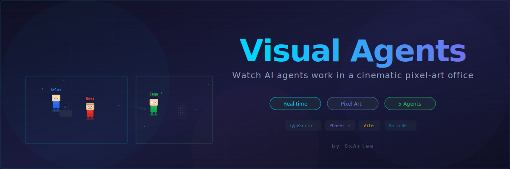
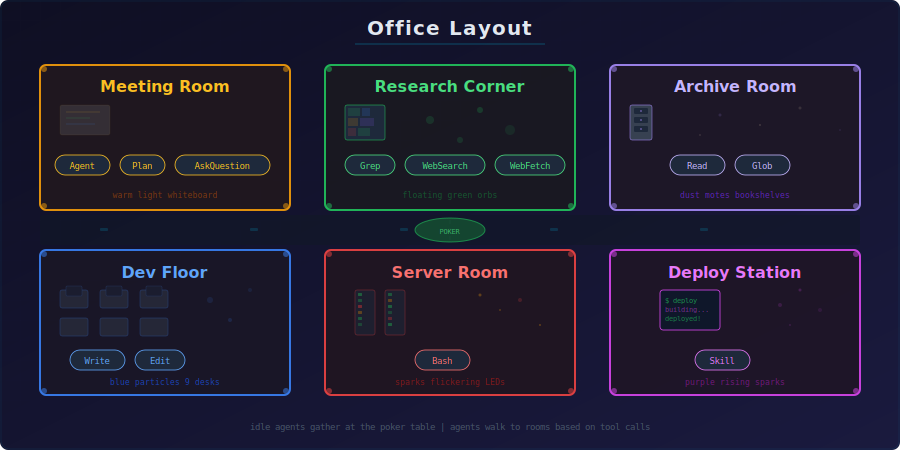
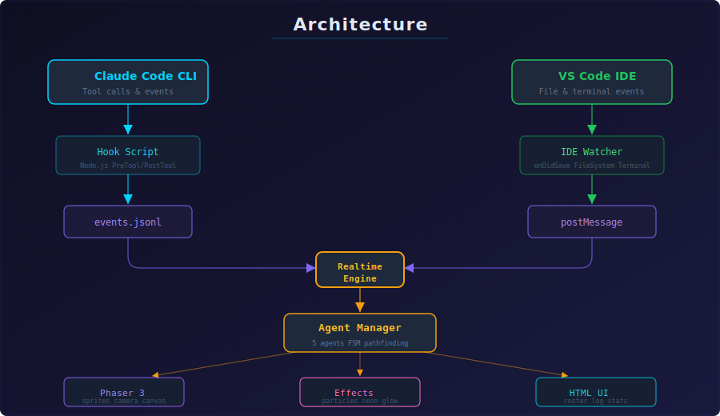

<div align="center">



<br/>

[](https://opensource.org/licenses/MIT)
[](https://github.com/FomoDonkey/VisualAgents/releases)
[](https://marketplace.visualstudio.com/)
[](https://www.typescriptlang.org/)
[](https://phaser.io/)
[](CONTRIBUTING.md)

<br/>

[Getting Started](#-getting-started) · [Features](#-features) · [Architecture](#-architecture) · [Contributing](CONTRIBUTING.md) · [Changelog](CHANGELOG.md)

</div>

---

## Highlights

| | Feature | Description |
|---|---|---|
| **Cinematic Office** | Neon-lit rooms, animated monitors with scrolling code, flickering server LEDs, swaying plants, holographic signs, floor reflections, dynamic lighting |
| **Expressive Agents** | 3D-shaded characters with blinking eyes, colored irises, facial expressions, walking animations, glowing trails |
| **Smart Camera** | Auto-follows active agents, frames multiple workers simultaneously, returns to the poker table when everyone's idle |
| **Real-Time Log** | Every tool call logged with timestamps, icons, and color coding |
| **Zero Config** | IDE watcher captures file changes from any AI agent automatically — no setup for Antigravity |
| **Poker Table** | Idle agents sit around a detailed poker table playing cards until work arrives |

---

## Features

### Live Agent Visualization

Every tool call from your AI agent is mapped to a room in the office:

<div align="center">

</div>

<br/>

### Dual Event Sources

- **Claude Code hooks** — captures every tool use with full detail (tool name, file path, result)
- **IDE activity watcher** — detects file saves, creates, deletes, and terminal activity from any AI agent (Antigravity Gemini, Copilot, Cursor, etc.)

Both sources run simultaneously.

### Interactive Controls

| Input | Action |
|-------|--------|
| **Click** agent | Follow with camera |
| **Double-click** agent | Enter first-person view |
| **Pencil icon** | Rename agent |
| **Scroll wheel** / `+`/`-` | Zoom in/out |
| **WASD** | Pan camera |
| **Overview** button | See entire office |

Auto-camera resumes after 5 seconds of no input.

### Visual Effects

<details>
<summary><strong>Full list of visual effects</strong></summary>

- Neon-pulsing room borders with accent colors
- Animated desk monitors with typing effects and blinking cursors
- Server rack LEDs that flicker independently
- Plants that sway gently with wind animation
- Room glow that intensifies when agents work inside
- Energy beams connecting working agents to their room
- Agent reflections on the floor with shimmer
- Dynamic light cones under each agent
- Per-room ambient particles (sparks, dust, orbs)
- Scanlines on wall monitors
- Holographic room names that breathe
- Idle pulse glow over the poker table
- Floating task descriptions on assignment
- Day/night ambient cycle
- Glowing trails behind walking agents
- Detailed office decorations (ceiling lights, rugs, wall art, vending machine, exit signs, and more)

</details>

### Dashboard

- **Left panel** — team roster with live status, current task, location, and progress bar
- **Right panel** — real-time activity log with icons per tool type
- **Top bar** — aggregate stats: tasks completed, files edited, tests run, deploys, success rate

---

## Getting Started

### Prerequisites

- [Node.js](https://nodejs.org/) (v18+)
- [VS Code](https://code.visualstudio.com/) 1.85+ / Antigravity / any VS Code fork
- [Claude Code CLI](https://docs.anthropic.com/en/docs/claude-code) (for Claude Code integration)

### Option A: VS Code Extension

```bash
# Install from marketplace
code --install-extension visualagents.visualagents

# For Antigravity
antigravity --install-extension visualagents.visualagents
```

Then open the command palette (`Ctrl+Shift+P` / `Cmd+Shift+P`) and run:

```
VisualAgents: Open Agent Visualizer
VisualAgents: Connect Claude Code (Setup Hooks)
```

Choose **Auto-configure (project)** or **Auto-configure (global)**, then restart Claude Code.

### Option B: Standalone (Development)

```bash
# Clone the repository
git clone https://github.com/FomoDonkey/VisualAgents.git
cd VisualAgents

# Install dependencies
npm install

# Start dev server
npm run dev
```

Opens at `http://localhost:5173` with hot reload.

### Build Commands

| Command | Description |
|---------|-------------|
| `npm run dev` | Start development server with hot reload |
| `npm run build` | Build for production |
| `npm run build:extension` | Build VS Code extension (webview + extension code) |
| `npm run package:vsix` | Package `.vsix` for distribution |
| `npm run preview` | Preview production build |

---

## Architecture

<div align="center">

</div>

<br/>

### Project Structure

```
visual-agents/
├── src/                        # Main visualization source
│   ├── agents/                 # Agent logic, state machine, sprites
│   ├── effects/                # Particles, neon, day/night, cinematic
│   ├── scenes/                 # Phaser scenes (Boot, World, HUD)
│   ├── realtime/               # Event polling & mapping
│   ├── simulation/             # Event bus
│   ├── sprites/                # Procedural sprite generation
│   ├── ui/                     # Camera, HTML panels, billboards
│   ├── world/                  # Office renderer, pathfinding, layout
│   ├── types/                  # TypeScript definitions
│   ├── config.ts               # Global configuration
│   └── main.ts                 # Entry point
├── server/                     # Vite plugin for dev API
├── extension/                  # VS Code extension
│   ├── src/                    # Extension source (panel, watchers, hooks)
│   ├── package.json            # Extension manifest
│   └── CHANGELOG.md            # Extension changelog
├── index.html                  # Main HTML layout
├── vite.config.ts              # Vite config
└── package.json                # Project config
```

### Tech Stack

| Technology | Purpose |
|-----------|---------|
| **Phaser 3** | Game engine for pixel-art rendering |
| **TypeScript** | Type-safe source code |
| **Vite** | Build tool with custom API plugin |
| **EasyStar.js** | A* pathfinding for agent navigation |
| **VS Code API** | Extension with webview panels |

---

## Configuration

### VS Code Extension Settings

| Setting | Type | Default | Description |
|---------|------|---------|-------------|
| `visualagents.eventsFile` | `string` | `""` | Path to `events.jsonl`. Leave empty to auto-detect. |
| `visualagents.autoOpen` | `boolean` | `false` | Auto-open visualizer when events are detected. |

### Extension Commands

| Command | Description |
|---------|-------------|
| `VisualAgents: Open Agent Visualizer` | Opens the pixel-art office panel |
| `VisualAgents: Connect Claude Code (Setup Hooks)` | Configures Claude Code hooks |
| `VisualAgents: Set Events File Path` | Manually set `events.jsonl` path |

---

## Event Format

Events are streamed via `events.jsonl` (one JSON object per line):

```json
{
  "ts": 1774925764892,
  "phase": "pre",
  "tool": "Write",
  "input": "src/main.ts",
  "result": "success",
  "agent_id": "uuid-here",
  "agent_name": "Atlas"
}
```

### API Endpoints (dev server)

| Endpoint | Method | Description |
|----------|--------|-------------|
| `/api/events?since=<ts>` | `GET` | Fetch new events since timestamp |
| `/api/event` | `POST` | Inject a test event |
| `/api/clear` | `GET` | Clear all events |

---

## FAQ

<details>
<summary><strong>The agents aren't moving</strong></summary>

Run `VisualAgents: Connect Claude Code (Setup Hooks)` and restart Claude Code. Check that `events.jsonl` exists in your workspace.
</details>

<details>
<summary><strong>Can I use this without Claude Code?</strong></summary>

Yes. The IDE watcher captures file changes from any source automatically — no hooks needed.
</details>

<details>
<summary><strong>Does this slow down my editor?</strong></summary>

No. The hook runs in <10ms. The visualization uses Phaser.js with hardware-accelerated canvas rendering.
</details>

<details>
<summary><strong>Can I customize agent names?</strong></summary>

Click the pencil icon next to any agent name. Names persist across sessions via localStorage.
</details>

<details>
<summary><strong>The camera moves on its own</strong></summary>

That's the smart auto-camera. It follows active agents and returns to the poker table when idle. Use WASD or drag to take manual control — auto-tracking resumes after 5 seconds.
</details>

---

## Contributing

Contributions are welcome! Please read the [Contributing Guide](CONTRIBUTING.md) before submitting a PR.

## Security

For security concerns, please see our [Security Policy](SECURITY.md).

---

## License

This project is licensed under the **MIT License** — see the [LICENSE](LICENSE) file for details.

```
Copyright (c) 2026 0xArlee
```

The MIT License requires that the above copyright notice and permission notice be included in all copies or substantial portions of the Software. Any redistribution must retain the original copyright attribution to **0xArlee**.

---

<div align="center">

Made with by **0xArlee**

[Report Bug](https://github.com/FomoDonkey/VisualAgents/issues) · [Request Feature](https://github.com/FomoDonkey/VisualAgents/issues)

</div>
